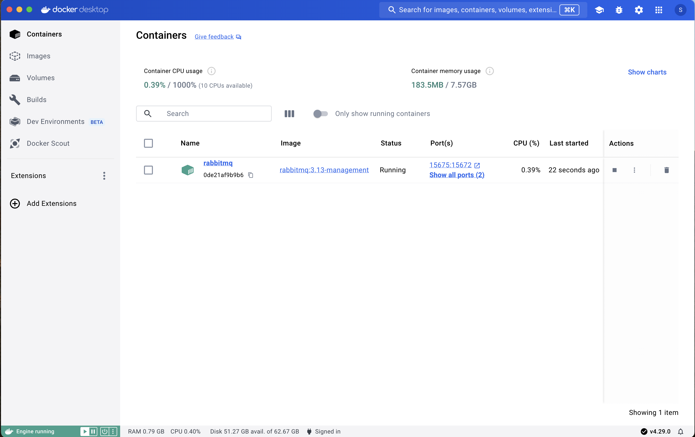
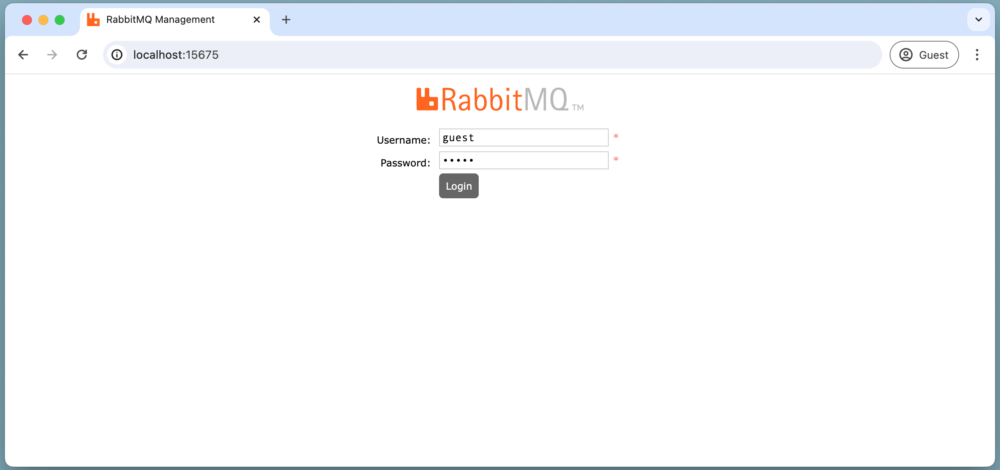
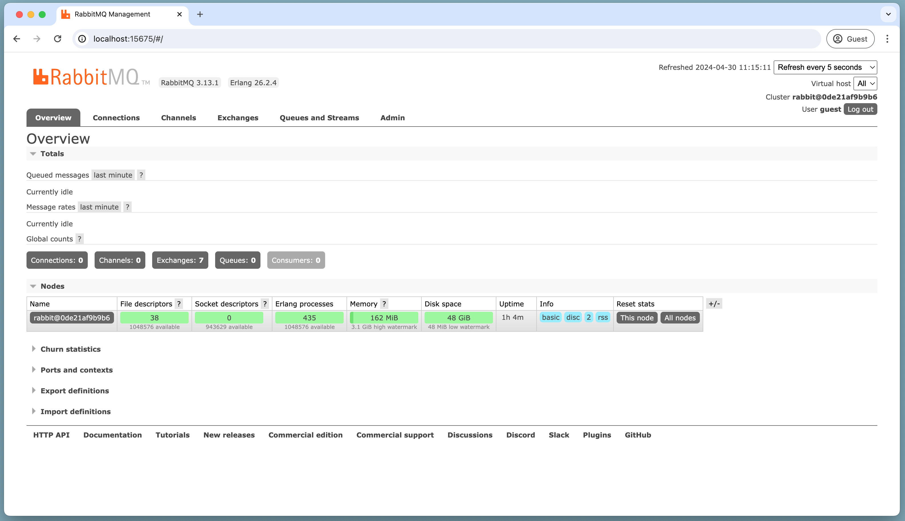

+++
title = 'First Hops With Rabbitmq'
date = 2024-04-30T07:14:42+02:00
tags = ['dev', 'rabbitmq']
draft = true
summary = "If you don't know you need RabbitMQ, you don't. If you don't know how to share near-realtime data to multiple endpoints (customers, devices, applications, etc), you probably need RabbitMQ. This guide can be your first step (hop)"
+++


If you don't know you need RabbitMQ, you don't. If you don't know how to share near-realtime data to multiple endpoints (customers, devices, applications, etc), you probably need RabbitMQ.


## RabbitMQ First Hop

For whatever reason, you have decided to jump into learning RabbitMQ. The
[RabbitMQ Website](https://www.rabbitmq.com/) is a fantastic resource, but can be overwhelming as an introduction. This post is will walk you through setting up a local sandbox to use on your local system.

## What We Are Going To Do

1. Verify a good starting point.
2. Use Docker to set up and run RabbitMQ locally.
3. Quick look at the RabbitMQ Admin.
4. Connect and Hello.
5. Bonus: Optional seciton for seeing cross-tech messages.

## 1. A Good Starting Point

You should have some comfort with the terminal. All examples here will be from a Mac, you will need to adjust based on your OS.

If you don't have Docker installed, you should do that now. [Docker Desktop](https://www.docker.com/products/docker-desktop/). That's all we need to get RabbitMQ up and running.

## 2. Set Up RabbitMQ

```console
$ docker run -d --rm --name rabbitmq -p 5675:5672 -p 15675:15672 rabbitmq:3.13-management
```

### What we did
We asked Docker to run the official [RabbitMQ Container](https://hub.docker.com/_/rabbitmq).

- `rabbitmq:3.13-management` is the name of the container we want to get pull down from [dockerhub](https://hub.docker.com/)
- `--rm` flag tells Docker to remove the container when we stop it.
- `-d` run in 'detached' mode, so we don't see all the logs in our terminal.
- `--name rabbitmq` is a convenience for now so we can find the container easily, but it is not necessary.
- `-p 5675:5672 -p 15675:15672` We have set the ports we use (external) to 5675 and 15675 to the ports that RabbitMQ is using (internal) 5672 and 15672 This is a convenience in case you have RabbitMQ running (for work for example). This will also allow us to demostrate how to configure our connection regardless of which ports we may be using in the future.

Assuming everything went well, you should see your working container in your Docker Desktop.



## 3. Log into RabbitMQ Admin

With our RabbitMQ container still running, go to [localhost:15675](http://localhost:15675) and log in with the default Username ("guest") and Password ("guest").



Once you are logged in you will see the Overview Page.



**Don't Panic!**

If you are able to see something similar to the above image, you have done everything right

## 4. Connect and Hello

Choose a technology that you are most comfortable with. You will want to choose more than 1 to take part in the bonus section.

[Elixir](#4a-elixir) - [Node/JavaScript](#4b-nodejavascript) - [Python](#4c-python) - [Go](#4d-go)

### 4a. Elixir

You can view the entire [**first_hop.livemd**](first_hop.livemd) or build your own following the steps below. These steps were modified from [rabbitmq.com/tutorials/tutorial-one-elixir](https://www.rabbitmq.com/tutorials/tutorial-one-elixir).

Let's grab the only library we will need, `amqp`

```elixir
Mix.install([
  {:amqp, "~> 3.3"}
])
```

Using the [AMQP Documentation](https://hexdocs.pm/amqp/AMQP.Connection.html), we see we can provide custom connection options, which we will need to do since we did not use the default port.

```elixir
options = [host: "localhost", port: 5675, virtual_host: "/", username: "guest", password: "guest"]
{:ok, connection} = AMQP.Connection.open(options)
{:ok, channel} = AMQP.Channel.open(connection)
```

```
{:ok,
 %AMQP.Channel{
   conn: %AMQP.Connection{pid: #PID<0.725.0>},
   pid: #PID<0.734.0>,
   custom_consumer: {AMQP.SelectiveConsumer, #PID<0.152.0>}
 }}
```

```elixir
AMQP.Queue.declare(channel, "sneakers")
```


```
{:ok, %{queue: "sneakers", message_count: 0, consumer_count: 0}}
```

```elixir
AMQP.Basic.publish(channel, "", "sneakers", "Setec Astronomy")
```


```
:ok
```

```elixir
defmodule Receive do
  def wait_for_messages do
    receive do
      {:basic_deliver, payload, _meta} ->
        IO.puts("Received: #{payload}")
        wait_for_messages()
    end
  end
end
```


```
{:module, Receive, <<70, 79, 82, 49, 0, 0, 7, ...>>, {:wait_for_messages, 0}}
```

```elixir
AMQP.Basic.consume(channel, "sneakers", nil, no_ack: true)
```


```
{:ok, "amq.ctag-yyIMwTC6t6i5-BhnC2xs3A"}
```

```elixir
Receive.wait_for_messages()
```


```
Received: Setec Astronomy
```


### 4b. Node/JavaScript

### 4c. Python

### 4d. Go


## Elixir Supervisor

```console
$ mix new sneakers --sup
```
update mix.exs

```console
$ mix deps.get
```
