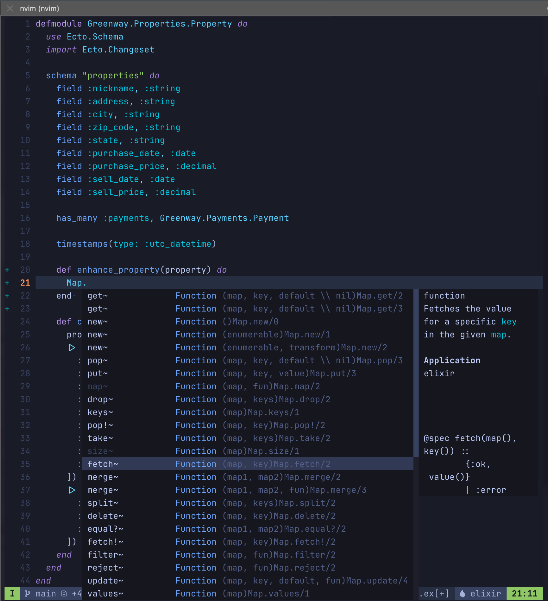

+++
title = 'Neovim and Elixir-ls Noob Edition'
date = 2024-08-10T18:01:04+02:00
tags = ['nvim', 'elixir', 'dev']
draft = false
summary = "The following is what I did, as a noob in the Vim ecosystem, to configure Neovim as my daily editor for Elixir development." 
+++


The following is what I did, as a noob in the Vim ecosystem, to configure Neovim as my daily editor for Elixir development. 


> There should be one -- and preferably only one -- obvious way to do it
>
> -- <cite>The Zen of Python</cite>

## Context

I am motivated by the wizards among us that can edit files with the greatest of ease using nothing but their trusted keyboards. Over the years I have become pretty comfortable using Vim keystrokes via "vim-modes" in IDEs, but the experiences fell short of my expectations. Zed came close, but their constant updates kept "changing" my experience in ways that finally broke me. 

All of my attempts to adopt Vim proper brought frustration with endless configuration options and no clear path to just get up and running. I wanted a "Zen of Python" approach to Vim setup and configuration, but I kept getting the Perl version (there should be **no** clear right way to do something -- *citation needed*). 

My attempts included going through Neovim's documentation, ThePrimeagen's videos, several "distributions" like LunarVIM and each time I would hit _magic_ that I didn't understand and prevented me from getting the experience I wanted. I even tried "Evil" (Emacs with Vim keys) with some success, but then some little thing would happen and my configuration _seemed_ unrecoverable. 

As an aside, I landed on Neovim over Vim only because I would rather learn how to use Lua over Vimscript. 

## The Journey

### The Kickstart I Needed

[kickstart.nvim](https://github.com/nvim-lua/kickstart.nvim) spoke to me. Not a distribution, but a "starting point for Neovim that is: Small, Single-file, Completely Documented". I watched [the video](https://www.youtube.com/watch?v=m8C0Cq9Uv9o) and if there was a T-shirt I probably would have bought it as well. 

I blew away any lingering *vim configurations on my mac and went through the insanely easy [setup process for Kickstart.nvim](https://www.youtube.com/watch?v=m8C0Cq9Uv9o) and gave it a try. Initial impressions were good, but I had some baggage from my other experiences that got in my way. I created a new elixir file which gave me I formatting out of the box but nothing else. No Elixir Language Server was automatically fetched and configured. I had expected some magic to kick in, and when it didn't I was both confused and happy. 

### Lazy

Kickstart.nvim comes with a single configuration file that uses [Lazy.nvim](https://github.com/folke/lazy.nvim) to manage plugins. The documented init.lua file said to modify my configuration file to add packages, but that just didn't feel right; my technical and intellectual baggage getting in the way of the clearly documented path. After several failed attempts at using Lazy, I was not able to add a package. Turns out I needed to update the configuration file :).  

### The Important Places

I still had a few issues. I thought I got rid of my past Vim installations, but I needed to look harder. I still had some cruft in hidden in `~/.config/nvim` and `~/.local/*` directories. I also discovered that there was something called Mason, which turned out to be a _new kind magic_ that I could like. 

### Mason-ery

[Mason](https://github.com/williamboman/mason.nvim) takes care of managing the dependencies for our Neovim configurations.  

## Setup Neovim with Elixir-ls

1. Follow the [install steps](https://github.com/williamboman/mason.nvim) for kickstart.nvim
2. Edit your `~/.config/nvim/init.lua`
3. Install elixir-ls with Mason. 

### 1. kickstart.nvim

Just follow the directions. I am not sure how valuable forking the repository is, but everything else made sense to me. Especially make sure you remove (or move) your previous Vim configuration files and packages from `~./config/nvim` and `~/.local/share`, `~/.local/bin`, `~/.local/state`.

### 2. Edit your init.lua file
Edit your `~/.config/nvim/init.lua` 
- add `elixirls = {}`  under `local servers = {...`

```lua
      local servers = {
        -- clangd = {},
        -- gopls = {},
        -- pyright = {},
        -- rust_analyzer = {},
        -- ... etc. See `:help lspconfig-all` for a list of all the pre-configured LSPs
        --
        -- Some languages (like typescript) have entire language plugins that can be useful:
        --    https://github.com/pmizio/typescript-tools.nvim
        --
        -- But for many setups, the LSP (`tsserver`) will work just fine
        -- tsserver = {},
        --
        elixirls = {},
        lua_ls = {
```
And then apply your changes with `:Lazy` and `Install (I)` in Lazy

### 3. Install elixir-ls with Mason

Enter the Vim command `:MasonInstall elixir-ls`

### Go Code!

Now when you open your next elixir file it should look a little like this, with all the Elixir bells and whistles - but much more controllable out of the box than VSCode and the others. 



### Some Handy IDE Commands

**Search**

`SPC s h` Help documentation

`SPC s f` Search all files

`SPC d s` Search symbols

**Navigating code hint**

`CTRL n` Next

`CTRL p` Previous

`CTRL y` Select

**Go to commands**

`g;` Go to previous changes

`g,` Go to newer changes


