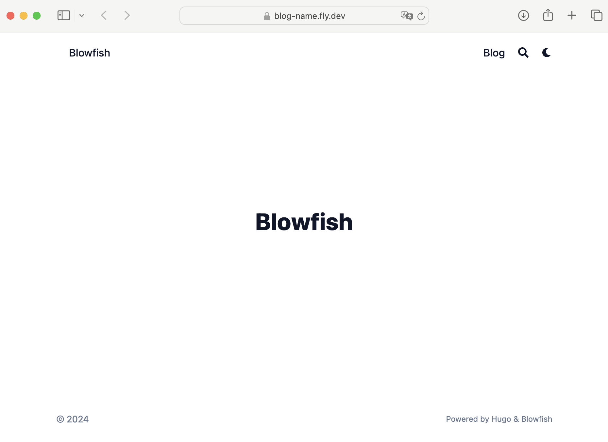

+++
title = 'Up and Running With HUGO'
date = 2024-04-15T12:40:00+01:00
tags = ['go', 'dev', 'blog', 'hugo', 'blowfish']
draft = false
+++

This post is mostly about my getting Hugo and Blowfish up and running. Feel free to jump to [Hugo Quickstart](#hugo-quick-start)

## Backstory

### Motivation

I have been using Elixir/Phoenix/Nimble for my blog posts for the last couple of years. It was okay, but I felt I was spending too much time tweaking the code and not enough time creating content. Additionally, I did not find the experience of creating new content pleasant - whatever that means.

Once I realized that I was open to using anything, I started to put together a list of "wants."

### New Blog Requirements

I want to...

- use a platform that I didn't have to think about once I set it up.
- write in markdown.
- own my content and maybe cross post to other platforms.
- use my own domain.
- have some creative control.
- enjoy creating content again (again, whatever that means).
- make it easier to share some things that might be helpful to others.
- be open to some different tech.

### Considerations

I looked at Ghost, Medium, Squarespace, Dev.to, and several other 'just start posting' platforms. I don't mind spending money for value, and I suggest that most platforms offer enough value for what they are selling, these things just were not valuable to me. I didn't want to automatically collect emails, or monetize my blog. I wasn't looking to build an audience (that I actively monitor).

I did spend about an hour considering writing my own static site generator (maybe in C) but eventually decided that this project didn't need any yack shaving. I did eventually start looking at static site generators which brought me to the usual players: Gatsby, Jekyll, Hugo and I tried them all.

### HUGO for the win

Hugo was fast. Really fast. To render my sample site with a few posts in development mode, the edits I made were rendered in sub-one-second time. Hugo also had a nice collection of starter templates (I chose Blowfish) and in pretty short time I had a working prototype of what my blog would be. Super happy with HUGO.

The rest of this post is sharing my setup, configuration, and hosting story.

## Hugo Quick Start

The following is how I set up and configured Hugo with Blowfish.

### My starting environment
I am using a Mac (Apple Silicon) with git, node, and homebrew. I am pretty sure I had GO installed already.

### Install Hugo and Blowfish

There are a lot of options when choosing how to install HUGO and Blowfish, the following worked well for quick setup and being able to maintain the installs.

```bash
$ brew install hugo
```

Navigate to where ever you want to setup your blog on your local system and run the following commands. Replace `<blog-name>` with the name of your blog. I used `mkumm-blog`.


```bash
# from ~/Dev
$ hugo new site <blog-name>

$ cd <blog-name>
```

```bash
# from ~/Dev/<blog-name>
$ git init

$ git submodule add -b main https://github.com/nunocoracao/blowfish.git themes/blowfish
```

I ignored all of the Blowfish install tools and any alternative methods of installation. Using the submodule puts you in a good place later on for updates, etc.

### Add Your Basic Config

Now there is one more thing to do before we can see our local development site. We need to copy our `<blog-name>/themes/blowfish/config` directory to the root of our project and make one small edit to one of the files.

```bash
├── archetypes
├── assets
├── content
├── data
├── hugo.toml
├── i18n
├── layouts
├── public
├── static
└── themes
    └── blowfish
    	└── config # copy this directory
    		└── _default
```

```bash
$ cp -r themes/blowfish/config .
```

```bash
├── archetypes
├── assets
├── content
└── config # directory just added
    └── _default
├── data
├── hugo.toml
├── i18n
├── layouts
├── public
├── static
└── themes
```

Now for that one small edit. Open up `<blog-name>/config/_default.hugo.toml` and uncomment line 5 so the start of the file looks like this.

```toml
# editing <blog-name>/config/_default/hugo.toml

# -- Site Configuration --
# Refer to the theme docs for more details about each of these parameters.
# https://blowfish.page/docs/getting-started/

theme = "blowfish"
# baseURL = "https://your_domain.com/"
defaultContentLanguage = "en"
.
.
.
```

### Launch Your Local Server

After saving `<blog-name>/config/_default/hugo.toml` you can run the following...

```bash
# from ~/Dev/<blog-name>/

$ hugo server
```

and then take a look at [localhost:1313](http://localhost:1313) in your browser.


### Thing We Did

By adding the Blowfish git submodule to our system, we ended up with a sub-directory called `themes/blowfish`. Do not edit files directly in the `themes/blowfish/` directory.

When Hugo is looking for the files it needs, it will first look in _your_ files, which is pretty much everything but your themes directory. If it can't find the file it needs, it will then lookup that file in your configured theme. You can think of your theme as basically your default source for all files.

When we ran the command `hugo server` we asked hugo to launch a basic webserver, dynamically generate the static files it needs and then server them on port 1313. As you might imagine, there are a lot of options available - well documented on the [HUGO Documentation Site - hugo server](https://gohugo.io/commands/hugo_server/). **Spoilers** To actaully build your site for production, the command is even shorter `hugo`.

And that's all it takes to set up a bare bones Hugo Server with a custom  themes. Let's create our first blog post.

## First Blog Post

In the documentation you will see there are many options for how you can set up your files for blog posts. To get started, let's keep it simple and leave enough flexibility for later.

### Hello World

Let's use Hugo's built in generators to give us a markdown file with helpful frontmatter. That is just a fancy way of asking Hugo to set up a new post for us.

```terminal
$ hugo new content posts/hello_world/index.md
```

This will create a new directory `content/posts/hello-world/index.md` with a markdown file which we will use to create our first blog post.

```text
# content/posts/hello-world/index.md

+++
title = 'Hello_world'
date = 2024-04-15T22:20:02+02:00
draft = true
+++
```

The text between the two `+++`s is our _frontmatter_ which is not directly visible in our post. Let's edit this file so we can see our post in a browser. By default, Hugo will not show posts with `draft = true`

```text
# content/posts/hello-world/index.md

+++
title = 'Hello World'
date = 2024-04-15T22:20:02+02:00
draft = true
+++

## Hello World!

We are here!
```

We edited our _frontmatter_ to give us a human looking title and changed draft from `true` to `false` as well as adding the obligatory "Hello World!" text. Once we save the file we can see our post added to our list of posts (which of course just has one at the moment): [localhost:1313/posts/](http://localhost:1313/posts/)


You can view the entire post by clicking on the listing. [localhost:1313/posts/hello_world](http://localhost:1313/posts/hello_world)


Looks great, but if we are starting from the home page, we will never find our posts. Let's fix that.

### Add "Blog" To Site Menu

Let's make one last edit so we have a link on our homepage to our posts. Uncomment lines 13-16 in `config/_default/menus.en.toml` so it looks like this

```toml
# -- Main Menu --
# The main menu is displayed in the header at the top of the page.
# Acceptable parameters are name, pageRef, page, url, title, weight.
#
# The simplest menu configuration is to provide:
#   name = The name to be displayed for this menu link
#   pageRef = The identifier of the page or section to link to
#
# By default the menu is ordered alphabetically. This can be
# overridden by providing a weight value. The menu will then be
# ordered by weight from lowest to highest.

[[main]]
 name = "Blog"
 pageRef = "posts"
 weight = 10

#[[main]]
#  name = "Parent"
#  weight = 2
.
.
```

We are telling Hugo to add "Blog" to our navigation and have it point to our "posts" content folder. When you save the above file click into your homepage, you should see the following:

 [homepage!](http://localhost:1313)

### Thing We Did

We used the Hugo generator to create a directory for our blog post and add an index.md which is the markdown file we edit to write our post. Technically we don't need to create a directory for every post, but with a directory we can add images, video, whatever to the directory and we can reference those files conveniently with a little markdown ``.

We edited our `config/_default/menus.en.toml` file to start to build out our navigation. If you explore that file (and other toml files) you see start to see how much control we have just by editing configuration.

Now is a good time to start exploring the sample blowfish site in `themes/blowfish/exampleSite` for inspiration on what is easily possible. By the way that example site is already up and running - it's the same one used on
[Blowfish Website](https://blowfish.page/)

I am hoping you have enough information to start developing your blog on Hugo/Blowfish. The next section will cover building your static site and how to push your blog on [fly.io](https://fly.io) (other examples are well documented on the [Hugo site](https://gohugo.io/hosting-and-deployment/)).

## Build and Deployment

So far we have updated some configuration files, added a theme, and temporarily rendered our content to view on our local browser. The next step will create a "permanent for now" version of our static site, which is all we really need to share with the world. To build our site we have to enter the following.

### Build

```bash
hugo
```

Yep, that's it. Our `public/` directory is now populated with everything you will need (and at the moment more) to deploy your site publicly.

### Prep for Deployment

Hugo's `hugo deploy` with some minimal configuration can be used to deploy to all the regular players and it is a great option. What is not well documented is setting up a more generic deployment using Docker and a provider like [fly.io](https://fly.io) - which is the provider I have been using for the last year or so.

**Set up a Docker File**

Create a new file named `Docker`

```bash
# from <blog-name>

touch Docker
```

Edit Docker file so the entire file looks like this

```txt
FROM pierrezemb/gostatic
COPY ./public/ /srv/http/
```

**Just for fun**

You can now run this docker file locally but feel free to move right to [Time to Fly.io](#time-to-fly.io)

Assuming you have docker on your local system.

```bash
# from ~/Dev/<blog-name>/
docker build -t myblog .
```

Once built, you can launch your blog with

```bash
docker run -d -p 8043:80 myblog
```

Because the server we chose uses port 8043, we just needed to map all of our localhost (port 80) requests to the docker server's port 8043.

Now you can go to your [localhost](http://localhost) and see your full static site as it will be deployed.

### Time to Fly.io

**Set up Fly.io cli tools**

If you don't have an account yet, go to [fly.io/docs/hands-on/install-flyctl/](https://fly.io/docs/hands-on/install-flyctl/) to set up `flyctl` and follow the first two steps. (I have no affiliation and receive no incentives from Fly.io).

Once you have installed `flyctl` and created your account, deployment is 2 steps away.

**Create your fly.toml file**

We are going to let flyctl create this for us.

```terminal
$ flyctl launch
```

You will be asked two questions, just answer 'N' in both cases
_Do you want to 'tweak' these settings?_. **N**
_Do you want to add dockerignore...?_. **N**

Fly will continue to deploy your site, but it won't actually work yet. Let's update that `fly.toml` that was just created for us.

```toml
1 # fly.toml app configuration file generated for blog-name on 2024-04-17T11:43:28+02:00
┆   2 #
┆   3 # See https://fly.io/docs/reference/configuration/ for information about how to use this file.
┆   4 #
┆   5
┆   6 app = 'blog-name'
┆   7 primary_region = 'waw'
┆   8
┆   9 [build]
┆  10
┆  11 [http_service]
┆  12 ▏ internal_port = 8080
┆  13 ▏ force_https = true
┆  14 ▏ auto_stop_machines = true
┆  15 ▏ auto_start_machines = true
┆  16 ▏ min_machines_running = 0
┆  17 ▏ processes = ['app']
┆  18
┆  19 [[vm]]
┆  20 ▏ memory = '1gb'
┆  21 ▏ cpu_kind = 'shared'
┆  22 ▏ cpus = 1
```

We need to update our internal port from "8080" to "8043" so it looks like this

```toml
┆  11 [http_service]
┆  12 ▏ internal_port = 8043
┆  13 ▏ force_https = true
┆  14 ▏ auto_stop_machines = true
┆  15 ▏ auto_start_machines = true
┆  16 ▏ min_machines_running = 0
┆  17 ▏ processes = ['app']
```

No we can run

```terminal
$ flyctl deploy
```

and after some behind the scenes magic, follow the link it provides to view your newly published site! 🎉



### Destroy App

Fly.io let's you use up to $5 of resources for free each month so our new blog probably won't cost us anything, but there probably is no reason to keep this running.

Go to your [Fly.io Dashboard](https://fly.io/dashboard) and click on your new App. If this is your first time using Fly, it will be the only App listed.


Then scroll to the bottom of the page and click "Settings", this will give you the option to "Delete app"


And after a confirmation step, your app has been deleted.

## Next Steps
